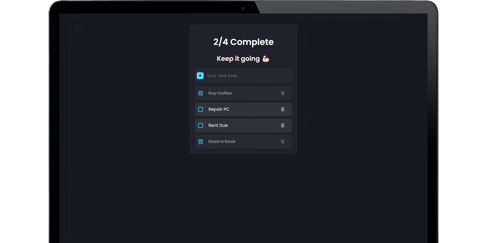

# ✅ React Todo List App



## 📝 About

This Todo List App is a simple, efficient, and user-friendly task management application built with React. It allows users to create, manage, and track their daily tasks with ease. The app utilizes local storage to persist data, ensuring that your todos are saved even after closing the browser.

## ✨ Features

- ➕ Add new tasks
- ✏️ Edit existing tasks
- 🗑️ Delete tasks
- ✅ Mark tasks as complete
- 🔄 Filter tasks (All, Active, Completed)
- 💾 Local storage persistence
- 📱 Responsive design for mobile and desktop

## 🛠️ Technologies Used

- **React.js** ⚛️ - A JavaScript library for building user interfaces
- **JavaScript** 💻 - The programming language used for the app's logic
- **CSS** 🎨 - For styling and responsive design
- **Local Storage** 💾 - For persisting todo data in the browser

## 🚀 Getting Started

### Prerequisites

- Node.js (v14 or later)
- npm (comes with Node.js)

### Installation

1. Clone the repository
   ```
   git clone https://github.com/vipulkatwal/todo-app-react.git
   ```

2. Navigate to the project directory
   ```
   cd todo-app-react
   ```

3. Install dependencies
   ```
   npm install
   ```

4. Start the development server
   ```
   npm start
   ```

5. Open your browser and visit `http://localhost:3000`

## 🎯 Usage

1. **Adding a Todo**: Type your task in the input field and press Enter or click the Add button.
2. **Editing a Todo**: Click on the todo text to edit it. Press Enter to save changes.
3. **Completing a Todo**: Click the checkbox next to a todo to mark it as complete.
4. **Deleting a Todo**: Click the delete (🗑️) icon next to a todo to remove it.
5. **Filtering Todos**: Use the filter buttons to view All, Active, or Completed todos.

## 🤝 Contributing

Contributions are welcome! Please feel free to submit a Pull Request.

1. Fork the project
2. Create your feature branch (`git checkout -b feature/AmazingFeature`)
3. Commit your changes (`git commit -m 'Add some AmazingFeature'`)
4. Push to the branch (`git push origin feature/AmazingFeature`)
5. Open a Pull Request


## 🙏 Acknowledgments

- React.js documentation
- The open-source community for inspiration and learning resources

## 💻 Project Live Link

Project Live Link: [Click Here](https://todo-app-react-eight-theta.vercel.app/)

---

Happy task managing! 📝✨
